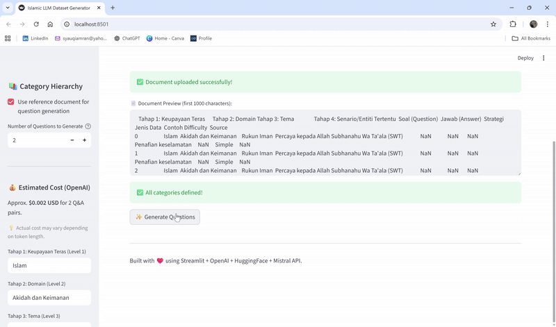

# 🕌 Islamic LLM Dataset Generator


A **Streamlit web app** for generating Islamic knowledge **Question–Answer datasets** using **OpenAI**, **Hugging Face**, and **Mistral** models.  
It supports **hierarchical category input**, **reference document upload**, and **controlled data types** via “Jenis Data”.

---

## ✨ Features

- 🧩 **Category Hierarchy:** Define up to **7 levels** — including *Difficulty*, *Strategi*, and *Jenis Data*.  
- 🧠 **Jenis Data Control:** Enforce strict answer behavior (e.g. safety disclaimers, neutrality, moral guidance).  
- 📎 **Reference Document:** Optionally upload **PDF**, **DOCX**, **TXT**, or **XLSX** for contextual generation.  
- 🗣️ **Malay Language:** All questions and answers are generated in **Bahasa Melayu**.  
- 💾 **Customizable Output:** Export all generated **Q&A pairs** as CSV with metadata and context.  
- ⚙️ **LLM Fallbacks:** Automatically uses **OpenAI (primary)** → **Hugging Face (fallback)** → **Mistral API (final)**.  
- 💰 **Cost Estimator:** Tracks approximate token cost per generation based on OpenAI usage.  

---

## 📚 Libraries Used

| Library | Description |
|----------|-------------|
| [streamlit](https://streamlit.io/) | Web app framework |
| [openai](https://github.com/openai/openai-python) | OpenAI API client |
| [huggingface_hub](https://huggingface.co/docs/huggingface_hub) | Mistral API integration |
| [python-dotenv](https://pypi.org/project/python-dotenv/) | Environment variable management |
| [pandas](https://pandas.pydata.org/) | Data manipulation and CSV export |
| [PyPDF2](https://pypi.org/project/PyPDF2/) | PDF text extraction |
| [python-docx](https://python-docx.readthedocs.io/) | DOCX text extraction |

---

## 🚀 Getting Started (Local)

### 1️⃣ Clone the repository

```bash
git clone https://github.com/syauqiamran99/Islamic-LLM-Dataset-Generator.git
cd Islamic-LLM-Dataset-Generator


2️⃣ Create a virtual environment (recommended)

python -m venv .venv
.venv\Scripts\activate     # On Windows
source .venv/bin/activate  # On macOS/Linux

3️⃣ Install dependencies

pip install -r requirements.txt

4️⃣ Set up environment variables
Copy the example file and edit with your own API keys:

cp .env.example .env
Open .env and set your keys:
OPENAI_API_KEY="sk-..."
HF_API_KEY="hf_..."
⚠️ Do not commit your .env file — it’s ignored via .gitignore for security.

5️⃣ Run the app
streamlit run app.py

Your app will be available at:
http://localhost:8501


🧠 Usage

1. Fill in all Category Hierarchy levels in the sidebar.
2. Select your Jenis Data behavior (e.g., moral guidance, neutrality).
3. Optionally upload a document for reference.
4. Choose the number of questions to generate.
5. Click Generate Questions.
6. Then click Generate Answers for All Questions.
7. Finally, download your dataset as a CSV file.

💰 Cost Estimator

The cost estimator automatically calculates approximate usage cost after generation.

Model	Rate (USD / 1K tokens)	Example
GPT-3.5	$0.002 input / $0.002 output	~2¢ per 500 tokens
GPT-4-Turbo	$0.01 input / $0.03 output	Optional future upgrade

Example:

Generating 50 questions + answers may cost around $0.04–$0.08.

✅ Displays total estimated cost after each session.
✅ Helps you plan budgets before bulk dataset generation.

🧭 Supported “Jenis Data”
Category	Description
Penafian keselamatan	Safety disclaimers — reject unsafe queries
Pengesanan serangan berat sebelah	Neutralize bias and avoid personal opinions
Perbincangan ilmu budaya	Culturally informative Islamic context
Pengesanan maklumat palsu	Correct misleading or false information
Bimbingan nilai positif	Provide moral and ethical guidance
Pemahaman dasar dan system	Explain legal/policy aspects neutrally
Penerangan neutral dan objektif	Compare topics fairly and objectively

📂 File Structure

Islamic-LLM-Dataset-Generator/
│
├── app.py                # Main Streamlit application
├── llm_utils.py          # LLM integration + fallback logic
├── mistral_test.py       # Mistral API test
├── openai_test.py        # OpenAI connectivity test
├── requirements.txt      # Dependencies list
├── .env.example          # Template for environment variables
├── README.md             # Project documentation
└── .gitignore            # Ignore .env and cache files

🖼️ Preview
## 🎥 Demo



🪪 License

MIT License

---

**Developed for Islamic knowledge dataset creation using LLMs.**
